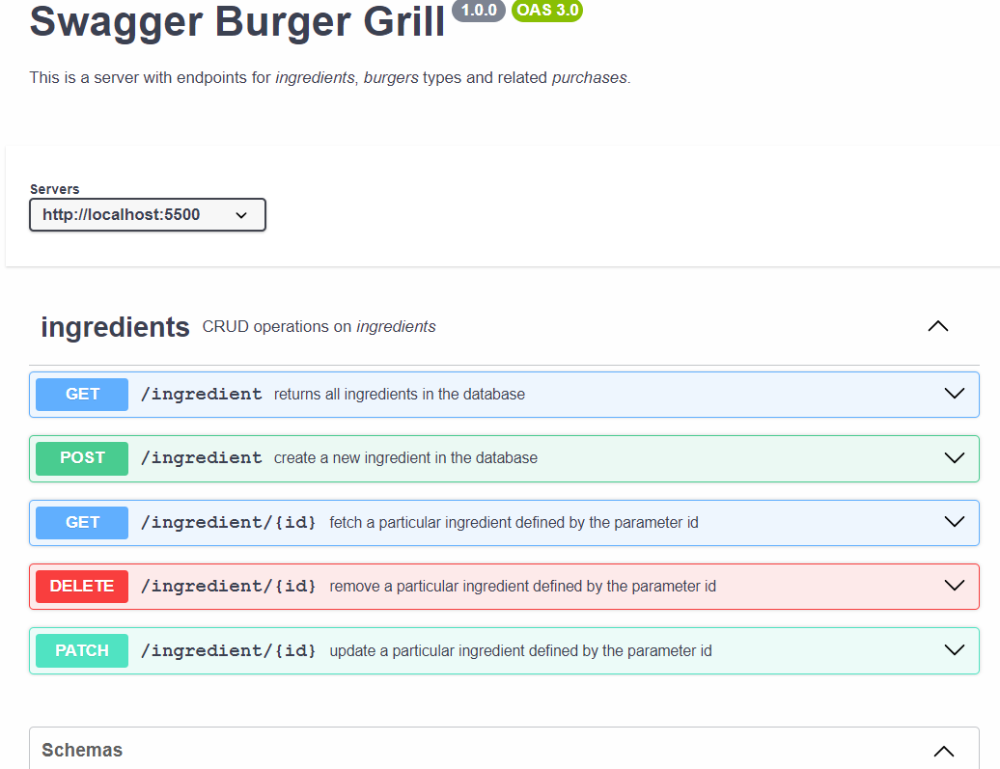
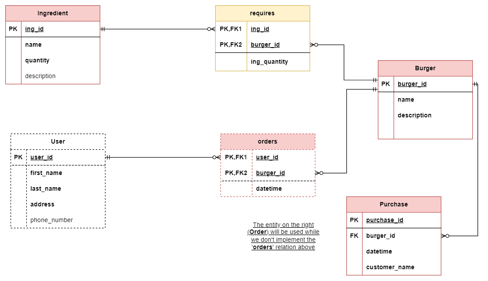
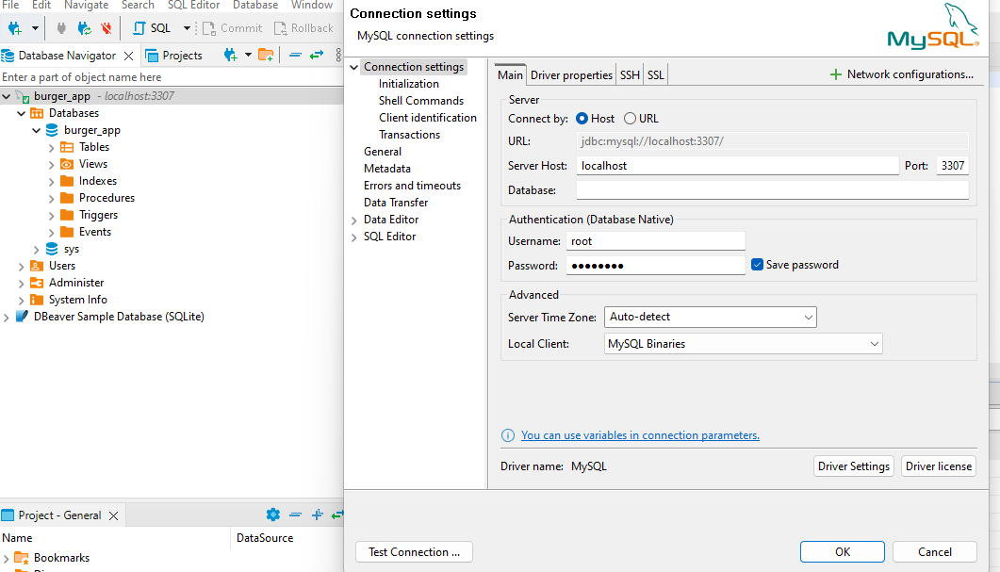
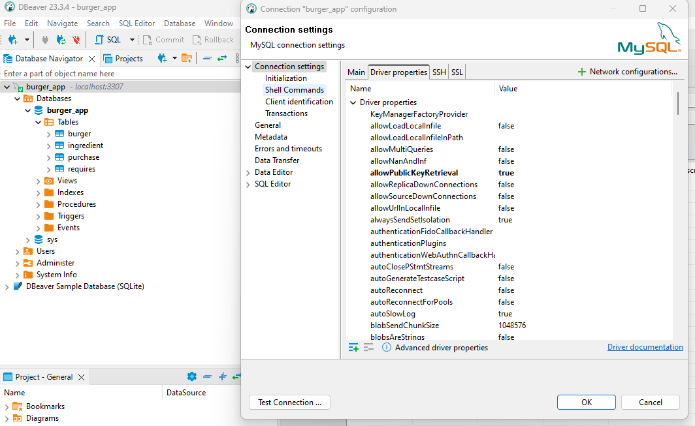
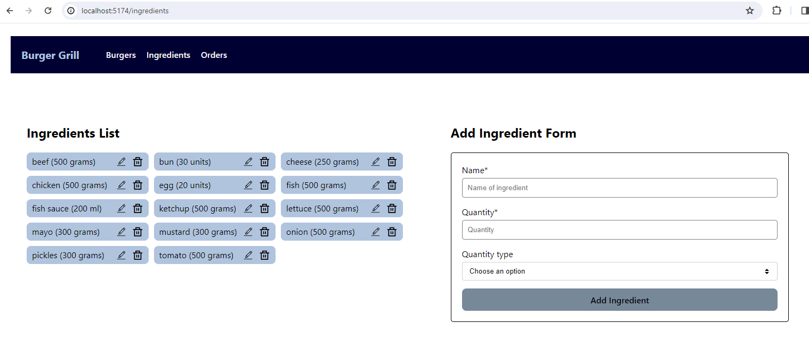
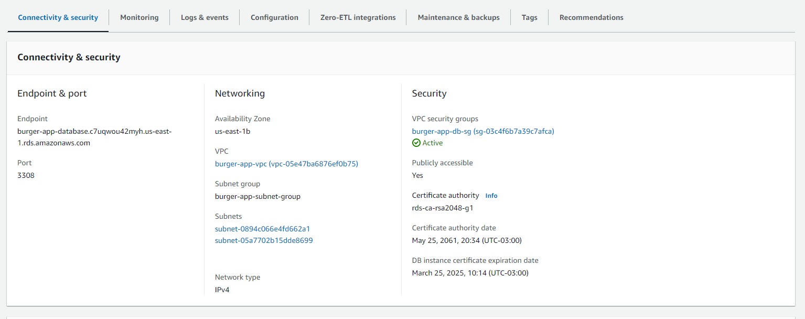
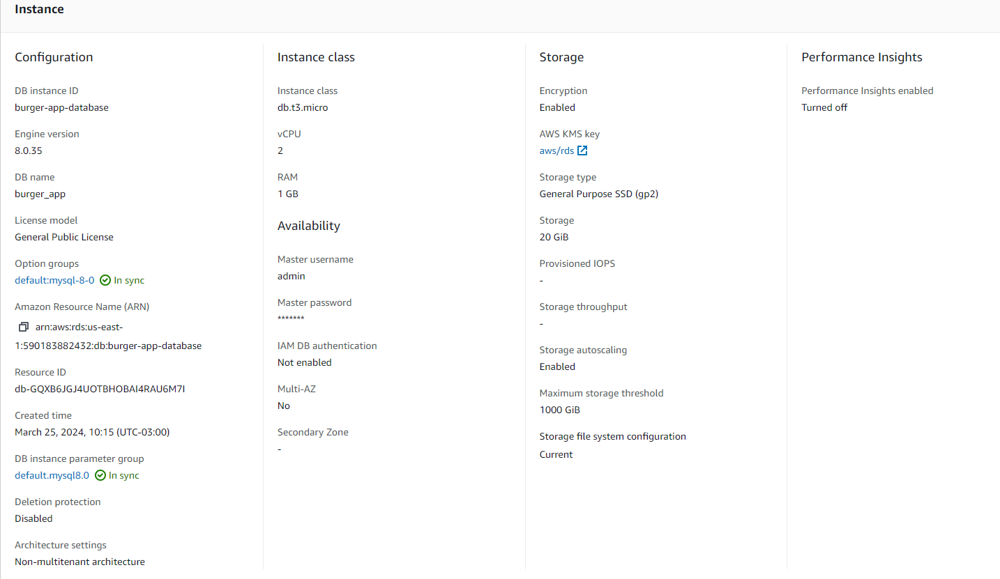

# Burger Grill

This is an application that supports the following functionalities:

- Create, list (read), update and delete ingredients and their quantities needed to prepare the several burgers that are offered;
- List (read), update and delete burgers menu;
- Create new kinds of burgers with their corresponding (available) ingredients
- Register burger orders by users of the system;

## Implementation

The complete project is comprised of two main folders, _frontend_ and _backend_, representing naturally the _client_ and the _server_ side of the application. The project was originally developed in two separate repositories ([here](https://github.com/alfiomartini/burgers-frontend) and [there](https://github.com/alfiomartini/burgers-backend)), but they are now significantly outdated.
The frontend is written with _React_ and _Typescript_, while the backend is written with _Node/Express/Typescript_. We use _MySQL_ as a database to provide persistence for all the relevant data. The application is fully containerized with _Docker_, with separate containers for the frontend, node api and database MySQL server. These containers are fully defined in the `compose.yaml` file located in the root folder of the project.

## Node api backend endpoints

### Open API specification

- The open api specification of the currently implemented endpoints is defined in the [`server.yaml`](./backend/server.yaml) file.
- In VSCode, with the extension [OpenAPI Editor](https://marketplace.visualstudio.com/items?itemName=42Crunch.vscode-openapi) installed, you can preview the open api specification by clicking on the file and then clicking on the _preview_ button, on the upper right corner of the editor.

### Database Model

- The database is implemented with MySQL 8.3 and the ER model files can be found in the [_database folder_](./backend/src/database/er-model/).

   

## Available scripts

### Root Project Folder

- `docker compose up` (or `docker compose up --force-recreate`): this creates the images and runs all the necessary containers. I recommend not to use _detached mode_, so you can verify in the terminal when the api server and the frontend are running. The api server runs at `localhost:5500` and the frontend at `localhost:5174`. The containers are dependent on each other: _database_ &larr; _api_ &larr; _frontend_ (where _x_ &larr; _y_ **means** _y_ <u>depends</u> on _x_), as specified in the docker compose yaml file. This file uses the `DockerFile`'s defined in the frontend and backend folders.
- `docker compose down`, (or `docker compose stop` or `docker compose down -v`): depending on what you want to do.
- Using the a SQL client like [DBeaver](https://dbeaver.io/) you can easily connect to the MySQL database container (at PORT `3307`). See image below:

   

- During the connection, if you receive an error message like `Public Key Retrieval is not allowed`, set this property (under connection settings) to be true. See image below:

   

### Frontend Folder (via corresponding [package.json](./frontend/package.json))

- `npm test`: to run all test written with _jest_ and _react testing library_.
- `nmp run dev:docker`: starts the React frontend (at `localhost: 5174`) that runs in the container. This script is automatically called by docker via `docker compose up`, and it is defined in corresponding [Dockerfile](./frontend/Dockerfile), in the frontend folder.
- `npm run dev`: in case you want to run the frontend alone (at `localhost:5173`), outside the docker environment. In this case, to access the database, do the following:

  - run the script `nmp run dev:aws` (in the _backend_ folder) which starts the node api version (at port `5600`) that connects with the public AWS MySQL database. This database runs at port `3308`, just in case you want to connect a SQL client to it.

- other scripts for formatting, linting and building.

   

### Backend Folder (via corresponding [package.json](./backend/package.json))

- `npm run dev`: starts the node api version that connects with the MySQL database running in another container. This script is automatically called by docker via `docker compose up`, and it is defined in corresponding [Dockerfile](./backend/Dockerfile), in the backend folder.
- `nmp run dev:aws`: starts the node api version that connects with the public AWS MySQL database. This database runs at port `3308`, just in case you want to connect a SQL client to it. Some observations with respect to this script:
  - The MySQL database instance for this script was created only for testing purposes, and it was deleted.
  - Thus, in order to run this script you will have to create your own MySQL RDS database on AWS.
  - The two images below show the parameters that I used for testing purposes.
  - The security group for the instance allowed all IP addresses to connect to the instance.
  - The two subnets comprising the db subnet group are public subnets.
  - The db endpoint is the value of the environment variable `MYSQL_AWS_HOST`.

   

   

- scripts for formatting, linting.

### Todo List

- At the moment only the CRUD operations for _ingredients_ are implemented in the front and backend.
- Frontend/Backend: CRUD for new burgers (lunches)
- Frontend/Backend: CRUD for new orders (lunches)
