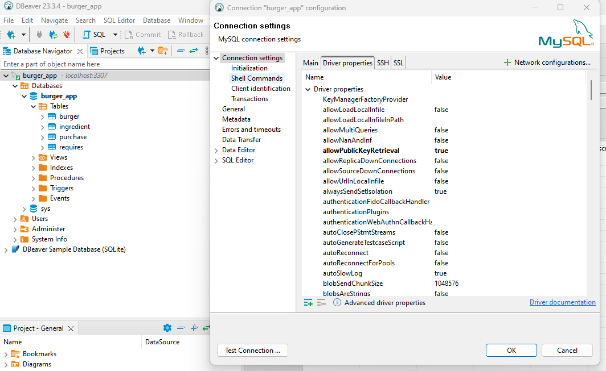

# Burger Grill

This is an application that supports the following functionalities:

- Create, list (read), update and delete ingredients and their quantities needed to prepare the several burgers that are offered;
- List (read), update and delete burgers menu;
- Create new kinds of burgers with their corresponding (available) ingredients
- Register burger orders by users of the system;

## Implementation

The frontend is written with React and typescript, while the backend is written with node/express/typescript. We use MySQL as a database to provide persistence for all the relevant data. The application is fully containerized with Docker, with separate containers for the frontend, node/express api and database MySQL server. These containers are fully defined in the `compose.yaml` file located in the root folder of the project.

## Node api backend endpoints

### Open API specification

- The open api specification of the currently implemented endpoints is defined in the [`server.yaml`](./backend/server.yaml).
- In VSCode, with the [OpenAPI Editor](https://marketplace.visualstudio.com/items?itemName=42Crunch.vscode-openapi) installed, you can preview the open api specification by clicking on the file and then clicking on the _preview_ button, on the upper right corner of the editor.

### Database Model

- The database is implemented with MySQL 8.3 and the ER model files can be found in the [_database folder_](./backend/src/database/er-model/).

   

- Using the a SQL client like [DBeaver](https://dbeaver.io/) you can easily connect to the MySQL database container (at PORT 3307). See image below:

   

- During the connection, if you receive an error message like `Public Key Retrieval is not allowed`, set this property (under connection settings) to be true. See image below:

   

## Available scripts

### Root Project Folder

- `docker compose up` (or `docker compose up --force-recreate`): this creates the images and runs all the necessary containers. I recommend not to use _detached mode_, so you can verify in the terminal when the api server and the frontend are running. The api server runs at `localhost:5500` and the frontend at `localhost:5174`. The containers are dependent on each other: _database_ &larr; _api_ &larr; _frontend_ (where _x_ &larr; _y_ **means** _y_ <u>depends</u> on _x_), as specified in the docker compose yaml file. This file uses the `DockerFile`'s defined in the frontend and backend folders.
- `docker compose stop`, `docker compose down`, `docker compose down -v`: depending on what you want to do.

### Frontend Folder

- `npm test`: to run all test written with _jest_ and _react testing library_.
- `npm run dev`: in case you want to run the frontend alone, outside docker. In this case you must also run the script `npm run json:server`, that mocks the REST API using _json server_. This api is served at `localhost:4500`. This assumes that you make the necessary changes written in the comments of the file `frontend/src/api/httpClient.ts`.
- other scripts for formatting, linting and building.

### Backend Folder

- scripts for formatting, linting.
- at the moment, the node/express api is configured to run only within docker, but can be easily configured to run outside of it, using the `mysql2` client defined in `backend/src/database/client.ts` with the environment variables listed in `backend/.env` file.

### Todo List

- At the moment only the CRUD operations for _ingredients_ are implemented in the front and backend.
- Frontend/Backend: CRUD for new burgers (lunches)
- Frontend/Backend: CRUD for new orders (lunches)
